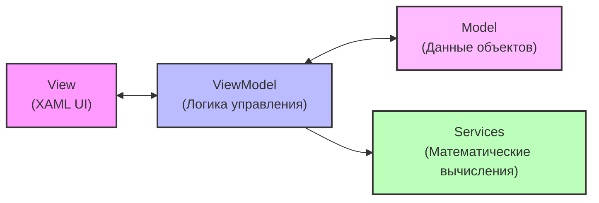

# Multicriterial Method — Выбор площадки под химическое предприятие (ЭЛЕКТРА I)

## О проекте

WPF-приложение на платформе .NET 8.0, предназначенное для решения задачи многокритериального анализа и поддержки принятия решений (MCDA). Программа автоматизирует процесс выбора оптимальной географической площадки под строительство химического предприятия на основе комплексных и противоречивых критериев.

В ходе работы приложение последовательно комбинирует три метода:
1. Метод ранга — для объективного определения весов критериев на основе согласованности оценок двух независимых экспертов.
2. Парето-оптимальность — на этапе предварительного анализа для отсева заведомо неконкурентоспособных (доминируемых) вариантов.
3. Метод ЭЛЕКТРА I (ELECTRE I) — как основное математическое ядро для построения нестрогого отношения превосходства, генерации интерактивного графа доминирования и выделения ядра лучших альтернатив.

---

## Архитектура и структура проекта

Проект строго следует паттерну MVVM (Model-View-ViewModel), что разделяет бизнес-логику математических расчётов от графического интерфейса пользователя.

```text
MulticriterialApp/
├── Models/
│   ├── Alternative.cs             # Модель альтернативы (название + оценки по критериям)
│   ├── Criterion.cs               # Модель критерия (направление max/min + вычисленный вес)
│   └── ElectreResult.cs           # Контейнер для матриц согласия, несогласия и ядра решений
├── Services/
│   ├── WeightService.cs           # Реализация метода ранга для экспертных оценок
│   ├── ParetoService.cs           # Алгоритм фильтрации и построения множества Парето
│   └── ElectreService.cs          # Построение матриц C(a,b), D(a,b) и автоматический подбор порогов
├── ViewModels/
│   └── MainViewModel.cs           # Прослойка управления, реактивная обработка слайдеров и команд
├── App.xaml / App.xaml.cs         # Точка входа в приложение и глобальные ресурсы
├── MainWindow.xaml                # Разметка UI (слайдеры, таблицы данных, вкладки результатов)
├── MainWindow.xaml.cs             # Логика динамической отрисовки графа превосходства на Canvas
└── MulticriterialApp.csproj       # Конфигурационный файл проекта .NET 8.0
```

### Взаимодействие компонентов (MVVM)



---

## Постановка математической задачи

Приложение по умолчанию инициализирует классическую матрицу решений из 6 альтернативных площадок (П1–П6), оцениваемых по 3 ключевым критериям:

| Критерий | Направление | Суть критерия |
| :--- | :---: | :--- |
| **K1** — Условия доставки | **max** | Чем выше оценка, тем лучше логистическая доступность |
| **K2** — Затраты на подготовку | **min** | Капитальные вложения на старте (минимизация затрат) |
| **K3** — Опасность загрязнения | **min** | Экологические риски для региона (минимизация ущерба) |

### Этапы расчёта:
1. Ранжирование весов: Эксперты выставляют ранги (места) критериям. Программа вычисляет средние значения и нормирует их, получая веса w_j, где сумма w_j = 1.
2. Парето-фильтр: Удаляются варианты, для которых существует альтернатива, превосходящая их по всем критериям одновременно.
3. Индексы согласия C(a,b): Измеряют суммарную силу критериев, подтверждающих гипотезу о том, что площадка a не хуже площадки b.
4. Индексы несогласия D(a,b): Оценивают максимальное нормализованное отклонение среди критериев, по которым площадка a уступает площадке b.
5. Фильтрация по порогам: Связь (стрелка графа) между площадками a → b устанавливается тогда и только тогда, когда выполняется условие: C(a,b) >= c* и D(a,b) <= d*.

---

## Ключевой функционал

* Интерактивные слайдеры порогов: Мгновенный пересчёт матриц согласия/несогласия при изменении пользователем значений c* и d*.
* Динамический граф превосходства: Автоматическое распределение вершин по кругу на Canvas и отрисовка векторов доминирования со стрелками. Вершины, входящие в финальное ядро лучших решений, подсвечиваются зеленым цветом.
* Автоматический подбор параметров: Функция сканирования координатной сетки порогов для автоматического поиска таких параметров c* и d*, при которых выделяется ровно 1 или 2 наиболее устойчивых оптимальных решения.
* Экспорт отчётов: Возможность сохранения детального пошагового текстового лога расчётов в файл .txt через стандартный диалог Windows.

---

## Установка и запуск

### Системные требования
* Операционная система: Windows 10 / 11
* Установленный .NET SDK 8.0 (или новее)
* Среда разработки: Visual Studio 2022 / VS Code / JetBrains Rider

### Инструкция по сборке

1. Клонируйте репозиторий с исходным кодом:
   ```bash
   git clone https://github.com
   cd MulticriterialApp
   ```

2. Восстановите зависимости проекта:
   ```bash
   dotnet restore
   ```

3. Выполните сборку приложения:
   ```bash
   dotnet build
   ```

4. Запустите скомпилированный WPF-интерфейс:
   ```bash
   dotnet run
   ```
